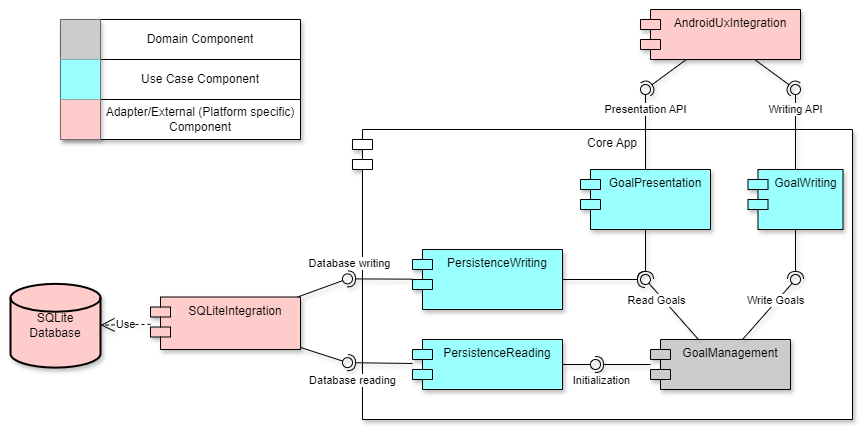
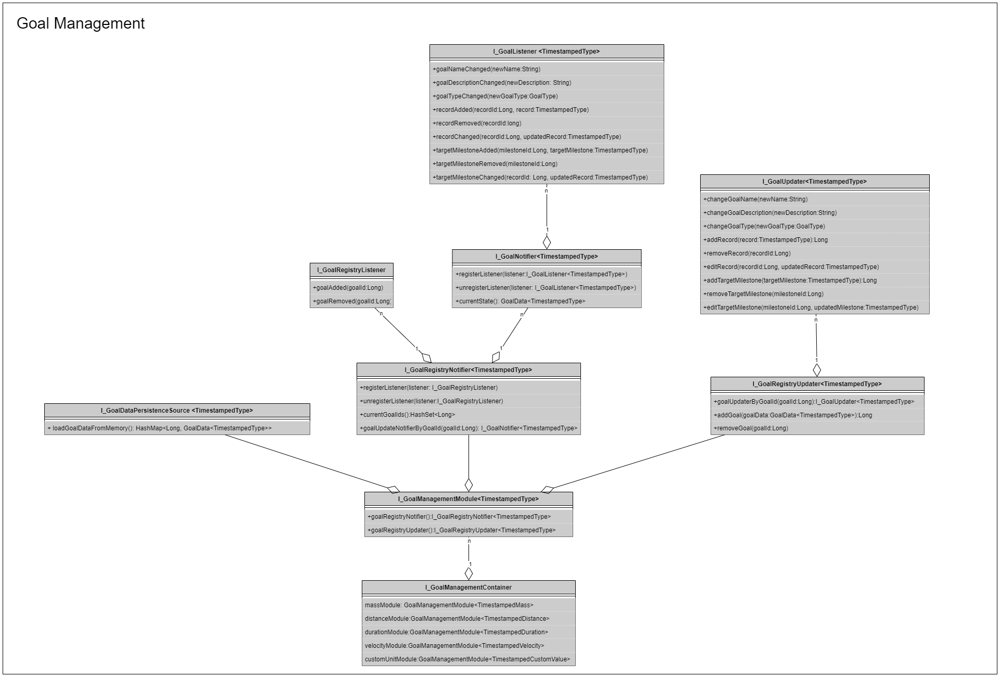

# Progressive Overload

## Goal

1) To provide an intuitive and fast way to track personal goals on a mobile device, 
2) such that doing so is fun and rewarding, rather than mentally taxing.

- The first goal can be achieved using minimalistic UX design, with a focus on limiting the number of user actions required to log a goal entry,
- and the second goal can be achieved by providing users with informative analytics on their progression towards their goals, using intuitive visual elements such as color-coded graphs, indicators, and meters.

## High-level Architectural Vision

In order to make potential future cross-platform work (e.g. iOS) possible, as much logic as possible should be placed in the core app (domain and use case layers).  This has the additional benefit of minimizing the maintenance costs associated with managing external dependencies, and also makes simplifies testing.

The following is a high-level class diagram of the current state of the app:

## Future Work

### iOS Integration

It is possible for this project to be ported to iOS, roughly in the following steps:

1) Set up a Java build system for the core app that is independent of, but preferably compatible with, Android Studio.
2) Move core app to its own submodule, such that there will be a progressive-overload-core repo and a progressive-overload-android repo that consumes the former as a submodule.
3) Make a progressive-overload-ios repo that will also consume progressive-overload-core as a submodule.  progressive-overload-ios will need its own build system that can cross compile Java for iOS, likely Codename One.
4) Reimpliment the adapter and external layers in progressive-overload-ios, using a suitable framework.
    - Note that if it is not feasible to use a framework such as Codename One, it may be possible to develop an IPC API, cross compile the java pieces, and write the external/adapter layers in an iOS-friendly language such as Swift, Flutter, or Objective-C.